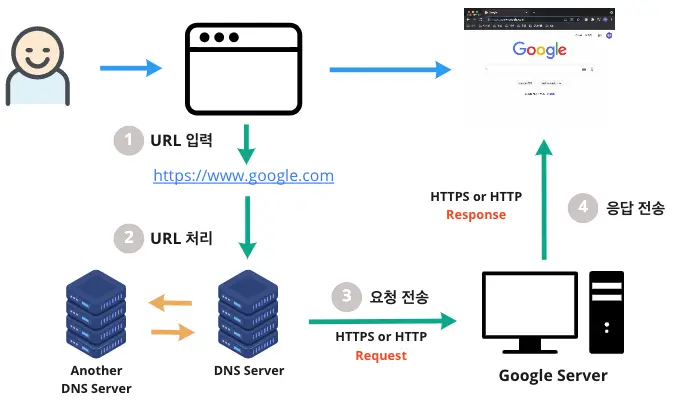
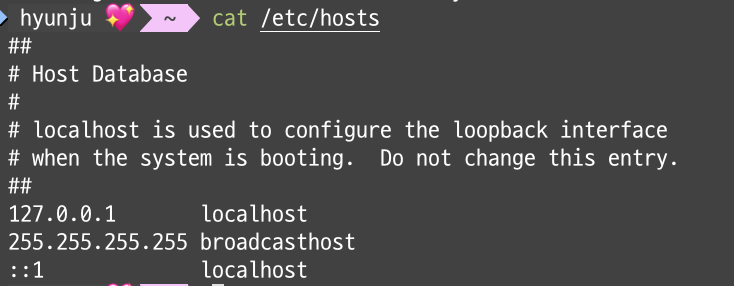
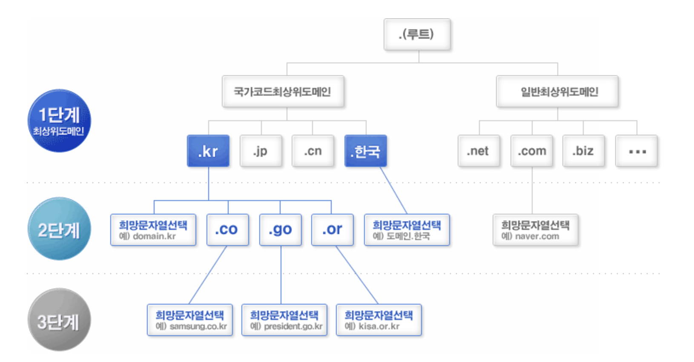

# 35장 - 38장:: 인터넷의 전화번호부, DNS

> 📅 스터디 날짜: 2024년 12월 17일

# Browser Rendering

브라우저 렌더링 과정에서 DNS를 만날 수 있다.  
사용자가 브라우저에 URL 입력 후, 서버는 요청한 URL에 대해 HTML을 넘겨주어 렌더링이 된다.

이 과정에서의 첫 단계는 **해당 페이지의 자원이 어디에 위치하는 지를 찾는 것**이다.  
⇒ **DNS 조회**

cf) [https://www.banghojin.site/study/web-rendering-methodology#렌더링](https://www.banghojin.site/study/web-rendering-methodology#%EB%A0%8C%EB%8D%94%EB%A7%81)

# DNS란?

> Domain Name System

인터넷의 전화번호부.  
**도메인 이름**을 주면, 매칭되는 **IP**를 돌려 준다.

  
cf) https://medium.com/@habinny/dns-90d63c848ad6

사람이 숫자로 이루어진 각각의 IP를 모두 외울 수 없기 때문에  
도메인 명을 통해 쉽게 접근할 수 있도록 만들어진 시스템이다.

DNS는 도메인 이름을 호스팅 서버의 IP 주소로 변환한다.

### DNS 와 호스팅의 관계

> 💡 호스팅: 웹사이트의 데이터를 저장하고 제공하는 역할   
> 서버를 빌리는 것. 외부의 서버를 빌려서 내 것처럼 사용하는 것

1. 사용자가 [`www.naver.com`](http://www.naver.com) 와 같은 도메인 등록
2. 도메인과 연결될 호스팅 서버(IP 주소) 설정
    1. ex: [`www.naver.com`](http://www.naver.com) → `123.456.78.90`
3. DNS 레코드 설정
    1. DNS 통해 도메인 이름과 호스팅 서버의 IP 주소 매핑
4. 웹사이트 접속
    1. [`www.naver.com`](http://www.naver.com) 입력시,
    2. DNS → 호스팅 서버 IP 주소 반환 → 웹 서버에서 데이터 전송 → 브라우저에 웹사이트 표시

# DNS 의 작동 방식

### 1. 브라우저 캐시 확인  
DNS 서버에 조회 요청을 보내기 전, 브라우저는 자신의 캐시에서 도메인의 IP 주소가 저장되어 있는지 먼저 확인.  
브라우저는 이전에 방문한 웹사이트의 DNS 정보를 캐싱해두기 때문에 가능!  
따라서 이전에 사이트에 방문한 이력이 있으면 → 해당 IP 주소로 바로 연결  
캐싱 정보가 없으면 다음 단계로 진행

### 2. 운영체제(OS) 캐시 확인
사용자 장치 내부의 DNS 캐시 정보 확인

### 3. 호스트 파일 확인  
hosts 파일은 도메인 이름과 IP 정보를 **수동으로** 연결 해놓은 목록.  
`지정할 IP` `도메인 명`  

Mac에 기본적으로 담겨 있는 hosts 파일 내용  

기본적으로 [`localhost`](http://localhost) 가 들어가 있기 때문에,  
프로젝트 실행시 `npm run dev`  했을 때 URL에 localhost가 담겨 이동해도 우리의 화면은 정상적으로 나왔던 것이다.

`cat /etc/hosts` → 조회  
`sudo vi /etc/hosts` → 수정

✔️ `127.0.0.1 [www.google.com](http://www.google.com)` 를 입력하면 어떻게 될까?  
    - 실제 구글 사이트가 아닌, 127.0.0.1 로 이동한다.  
    - 물론 hosts 파일은 자신의 기기에만 해당되기 때문에, 다른 기기에 영향을 끼치지는 않는다.

### 4. 로컬 DNS 서버 문의

- Local DNS 란?
  - 기본적으로 인터넷 사용시 IP를 할당해주는 통신사(ex. KT, SK, LG..)에 등록한다.
  - 이 통신사가 Local DNS 서버가 된다.
  - KT를 사용하는 집이면 → KT DNS 
- Local DNS 서버에도 없으면, 찾아내기 위해 다른 DNS 서버들과의 통신을 시작한다.

### 5. 루트 DNS 서버 문의  
- Local DNS는 Root DNS에 IP 주소를 요청한다.
- Root DNS란?
  - 국제 인터넷 주소 관리기구인 `ICANN` 에서 직접 관리하는 절대 존엄 서버이다.
  - 전 세계에 961개의 루트 DNS가 운영되고 있다.

### 6. TLD(최상위 도메인) DNS 서버 문의
- Local DNS는 TLD DNS에 IP 주소를 요청한다.
- TLD DNS Server란?
  - TLD는 도메인 등록 기관이 관리하는 서버이다. (Top-Level Domain)
  - `.com` , `.net`
  - 도메인의 목적, 종류, 국가를 나타낸다.

  
cf) [https://inpa.tistory.com/entry/WEB-🌐-DNS-개념-동작-완벽-이해-★-알기-쉽게-정리](https://inpa.tistory.com/entry/WEB-%F0%9F%8C%90-DNS-%EA%B0%9C%EB%85%90-%EB%8F%99%EC%9E%91-%EC%99%84%EB%B2%BD-%EC%9D%B4%ED%95%B4-%E2%98%85-%EC%95%8C%EA%B8%B0-%EC%89%BD%EA%B2%8C-%EC%A0%95%EB%A6%AC)

### 7. Authoritative DNS 서버 문의
- Local DNS는 Authoritative DNS에 IP 주소를 요청한다.
- Authoritative DNS란?
  - 특정 도메인에 대한 최종적인 DNS 레코드를 저장하고 있는 서버
  - 실제 개인 도메인과 IP 주소간의 관계가 기록/저장/변경되는 서버 → ‘권한’ 을 지닌다.

> 💡 위와 같이, **Local** DNS 서버가 차례대로  
**Root** DNS 서버 → **TLD** DNS 서버 → **Authoritative** DNS 서버에 요청하여,  
답을 찾는 과정을 **재귀적 쿼리(Recursive Query)**라고 부른다!  

### 8. IP 주소 반환 및 연결  
Authoritative DNS 서버에 [`www.naver.com`](http://www.naver.com) 의 IP 주소는 `222.122.195.6` 라는 응답을 한다.  
이를 수신한 Local DNS 서버는 이 정보를 캐싱하고, 단말(PC)에도 전달한다.

### 9. 웹페이지 로드  
웹 서버는 브라우저 요청에 따라, 웹 페이지의 데이터를 전송하고  
브라우저는 이를 렌더링하여, 사용자에게 최종적으로 보여주게 된다.