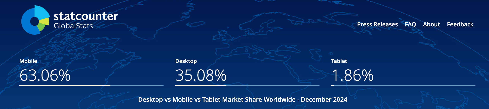
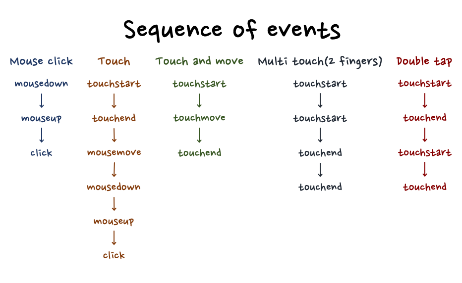

# 40장 - 41장:: Mouse 와 Touch 이벤트 비교 

> 📅 스터디 날짜: 2025년 1월 20일

  
https://gs.statcounter.com/platform-market-share/desktop-mobile-tablet

모바일 시장이 데스크톱 시장보다 커졌다.   
모바일 웹 브라우징의 중요성이 커진 만큼   
웹 개발을 할 때, 마우스 행동뿐만 아니라 **터치 동작**도 고려해야 한다.


> 나의 사례…)  
> 다이얼로그 열릴 때, 백그라운드 영역은 웹에서 마우스 스크롤 못하게 막아두었는데   
> 아이패드로 하니까 터치 스크롤은 그대로 작동되어, 다이얼로그의 드래그 기능에 이슈가 생겼던 경험이 있다.

# **마우스 이벤트와 터치 이벤트의 비교**

  
cf) https://ui.toast.com/posts/ko_20220106

| **특징** | **마우스 이벤트** | **터치 이벤트**                                                       |
| --- | --- |------------------------------------------------------------------|
| **주요 이벤트** | `mousedown`, `mouseup`, `mousemove`, `click`, `dblclick`, `mouseover`, `mouseout`, `mouseenter`, `mouseleave` | `touchstart`, `touchmove`, `touchend`, `touchcancel`             |
| **멀티포인트 지원** | 단일 포인터 | 멀티터치 지원  (`event.touches` 배열로 여러 터치 포인트 정보 제공)                   
| **호버 기능** | 커서가 요소 위에 있을 때 `hover` 상태 감지 | 호버 상태 X !! 요소를 실제로 터치해야 이벤트 발생  ⇒ 스타일 작업시 주의 필요                  |
| **이벤트 발생 순서** | 클릭 시: `mousedown` → `mouseup` → `click` | 터치 시: `touchstart` → (움직임이 있을 경우) `touchmove` → `touchend`       |
| **기본 동작** | 클릭 시 링크 이동, 드래그로 텍스트 선택  | 터치로 스크롤, 핀치 줌, 드래그 등                                             |
| **이벤트 데이터** | `event.clientX`, `event.clientY` 등으로 마우스 좌표 제공 | `event.touches` 배열로 터치 좌표 및 데이터 제공  ex) event.touches[0].clientY |
| **대상 요소 감지** | `event.target`를 통해 이벤트가 발생한 DOM 요소 감지 | 동일                                                               |

### Multi Touch

`event touches` : 모든 터치 포인트 정보를 포함한 배열 (좌표, 식별자 등)  
- 순서
    - 터치가 발생한 순서
- 최대 터치 지원 갯수
    - 대부분의 현대 브라우저와 기기는 최대 10개 터치 지원
    - 일부 구형 기기는 2~5개로 제한

# 주의할 점

- hover  
  데스크톱 환경에는 마우스를 통해 hover 상태를 지니지만, 터치 스크린에는 Hover 상태가 없다.  
  → 따라서 UI단에서는 hover에 의존하지 않도록 설계해야 한다.  
    - 대안
        - `:foucs` 상태
        - 클릭 이벤트
- 클릭 동작
    - 웹 애플리케이션은 데스크톱, 모바일 등에서 모두 동작해야 하므로
    - ‘마우스’와 ‘터치’의 클릭 이벤트 리스너를 함께 고려한다.  
    ```jsx
    element.addEventListener('click', handleEvent);
    element.addEventListener('touchend', handleEvent);
    ```
    - 마우스 - click
    - 터치 - touchend
- 스크롤
    - 터치 이벤트에서 스크롤이 발생하는 문제를 방지하려면 `event.preventDefault()`를 사용한다
    - 사용자는 단순 터치하려고 했지만, 의도와 다르게 스크롤이 발생할 수 있다  
    ```jsx
    element.addEventListener('touchmove', (e) => {
      e.preventDefault(); // 스크롤 방지
    });
    ```