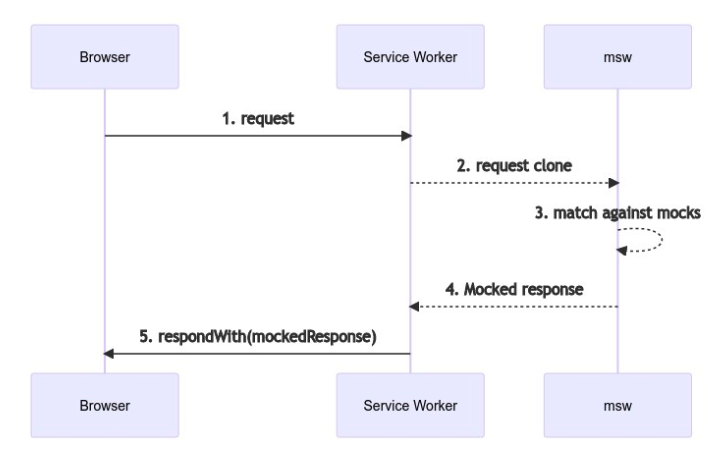

# 42장 - 44장:: Mock Service Worker에 대해 

> 📅 스터디 날짜: 2025년 1월 21일

> XMLHttpRequest 부분을 보다가, API 호출과 관련된   
> Mock Service Worker에 대해 정리해보고자 준비했습니다 ✏️

[Mock Service Worker](https://mswjs.io/)

## Mock Service Worker란?

API를 모킹(Mocking)하는 라이브러리  
서비스 워커를 사용하여 프론트단에서 요청한 네트워크 호출을 가로챈다  
마치, 실제로 백엔드 API의 응답이 온 것처럼 가짜 데이터로 응답을 받아 사용할 수 있다  
- 특징
    - Browser와 Node에서 사용 가능
    - REST API 와 GraphQL 모두 지원

## 왜 필요할까?

- 백엔드의 API 완성을 기다리지 않아도 된다.  
  프론트엔드 개발을 할 때, 백엔드 API가 완성될 때까지 기다려야 한다  
  동시에 하게 되면 API 작업으로 인해 프론트 작업에 지연이 될 수 있다  
  하지만 MSW를 사용하면 지정한 Mock 데이터를 반환함으로써, API를 미리 붙여 테스트할 수 있다

- 테스트 진행시 비용이 들지 않고 자유롭게 호출 가능하다.  
  출금 API 와 같이, 호출할 때마다 실제로 돈이 출금되는 API 등 여러 상황에 따라 API 호출이 제한된다면  
  MSW로 비용없이 빠르고 안전하게 API를 호출할 수 있다


## 작동 방식



1. 브라우저가 요청을 보낸다
2. 서비스 워커는 이를 가로챈다
3. 요청을 클론하여 MSW에 보낸다
4. MSW는 모킹한 응답을 다시 서비스 워커에 보낸다
5. 서비스 워커는 전달받은 Mocked Response를 브라우저에 보낸다

(서비스 워커는 브라우저 환경에서만 동작)

## Service Worker란?

**서비스 워커**는 브라우저와 서버 사이의 네트워크 요청을 가로채고 처리할 수 있는 **웹 API**로,  
웹 애플리케이션에 오프라인 지원, 캐싱, 푸시 알림 등의 기능을 제공하는 스크립트  

```text
서비스 워커는 웹 응용 프로그램, 브라우저, 그리고 (사용 가능한 경우) 네트워크 사이의 **프록시 서버 역할**을 합니다.
서비스 워커의 개발 의도는 여러가지가 있지만, 그 중에서도 효과적인 오프라인 경험을 생성하고,
**네트워크 요청을 가로채서 네트워크 사용 가능 여부에 따라 적절한 행동**을 취하고, 서버의 자산을 업데이트할 수 있습니다.
또한 푸시 알림과 백그라운드 동기화 API로의 접근도 제공합니다.

서비스 워커는 출처와 경로에 대해 등록하는 이벤트 기반 워커로서 JavaScript 파일의 형태를 갖고 있습니다.
```

https://developer.mozilla.org/ko/docs/Web/API/Service_Worker_API

- 특징
    - 논블로킹
        - 앱을 구동하는 주 JavaScript와는 다른 스레드에서 동작하므로 연산을 가로막지 X
    - HTTPS에서만 동작
        - 보안 상의 이유
        - 네트워크 요청을 수정할 수 있다는 점에서 중간자 공격에 취약
        - Firefox에서는 사생활 보호 모드에서 Service Worker API에 접근 불가
- 용도
    - 백그라운드 데이터 동기화
        - 인터넷 연결이 복구된 후 데이터 동기화와 같은 작업을 자동으로 수행
    - 오프라인 지원
        - 캐싱된 리소스를 통해 사용자가 네트워크 연결이 없는 상태에서도 애플리케이션을 사용하도록 지원
    - 푸시 알림
        - 백엔드 서버와 연동하여 푸시 알림을 전송하고 사용자에게 전달
        - [Push API](https://developer.mozilla.org/ko/docs/Web/API/Push_API)와 [Notifications API](https://developer.mozilla.org/ko/docs/Web/API/Notifications_API)를 통해 앱처럼 웹에서도 백그라운드 푸시 알림 전송 가능

## 사용법

```bash
npm install msw@latest --save-dev
```

1. handlers.js  
   요청 핸들러  
   가짜 API를 구현하기 위해, 요청이 왔을 때 모의 응답을 해주는 핸들러

    ```jsx
    // src/mocks/handlers.js
    import { http, HttpResponse } from 'msw'
     
    export const handlers = [
      // Intercept "GET https://example.com/user" requests...
      http.get('https://example.com/user', () => {
        // ...and respond to them using this JSON response.
        return HttpResponse.json({
          id: 'c7b3d8e0-5e0b-4b0f-8b3a-3b9f4b3d3b3d',
          firstName: 'John',
          lastName: 'Maverick',
        })
      }),
    ]
    ```

2. browser.js  
   서비스 워커 생성  
   핸들러 코드를 불러와, 서비스 워커 생성하고 주입

    ```jsx
    // src/mocks/browser.js
    import { setupWorker } from 'msw/browser'
    import { handlers } from './handlers'
     
    export const worker = setupWorker(...handlers)
    ```

3. index.jsx  
   서비스 워커 삽입  
   애플리케이션 진입점에 서비스 워커를 구동하는 코드를 넣는다.  
   `then` 을 하는 이유는, MSW가 켜지기 전에 App이 렌더링되면 에러가 나기 때문에 먼저 MSW를 가동한다

    ```jsx
    // src/index.jsx
    import React from 'react'
    import ReactDOM from 'react-dom'
    import { App } from './App'
     
    async function enableMocking() {
      if (process.env.NODE_ENV !== 'development') {
        return
      }
     
      const { worker } = await import('./mocks/browser')
     
      // `worker.start()` returns a Promise that resolves
      // once the Service Worker is up and ready to intercept requests.
      return worker.start()
    }
     
    enableMocking().then(() => {
      ReactDOM.render(<App />, rootElement)
    })
    ```

```jsx
// 🎉 MSW 성공적으로 불러오면, 개발자 도구의 콘솔창에 뜬다 !
[MSW] Mocking enabled.
```