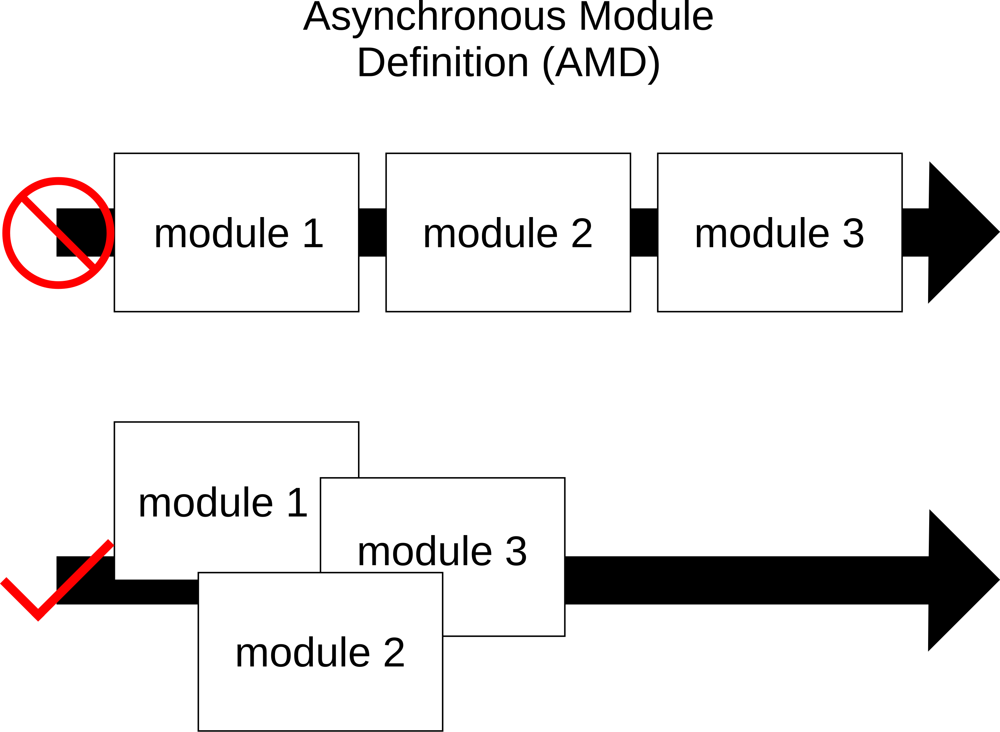

# 47장 - 49장:: 자바스크립트 모듈의 역사 

> 📅 스터디 날짜: 2025년 2월 4일

## 초기 (1995-2009)  
1995년 Javascript는 브라우저에서 동작하는 작은 스크립트 언어로 설계되었다.  
이에 따라 처음 등장했을 때에는 모듈 시스템이 없어서, 파일마다 독립적인 스코프를 갖지 않고 하나의 전역 객체 (Global Object)를 공유  
= 모든 스크립트가 전역 범위에서 실행되어 서로 접근할 수 있었다.

```jsx
<!DOCTYPE html>
<html>
  <head> </head>
  <body>
    <script src="./src/first.js"></script>
    <script src="./src/second.js"></script>
  </body>
</html>
```

```jsx
// first.js
function sum(x, y) {
  return x + y;
}
```

```jsx
// second.js
console.log(sum(10, 30)); // 40
```

—> second.js에서 sum 함수를 사용하려면 앞선 파일에서 반드시 sum 을 선언해야 한다.

**한계**

- script 태그의 순서 중요
- 전역변수가 100개.. 500개 → 많아질수록 충돌 발생
- 변수를 이미 선언했어도 뒤의 파일에서 같은 이름의 변수를 선언한다면 재정의

→ 애플리케이션이 커질수록 복잡성 증가

**방안**

IIFE (Immediately Invoked Function Expressions)  
함수 스코프 안에 있는 변수는 접근이 안되기 때문에, 내부 변수 보호를 위해 사용  
다만 밖에서 쓰기 위해선 return문으로 처리

```jsx
const module = (
  function() {
    var message = '안녕하세요';
    function foo() {
      return message;
    }
    function bar() {}
    return { foo: foo } // 반환
  }
)();
```

## CommonJS (2009)

CJS.  
2008년 V8 자바스크립트 엔진이 나타나면서, 모질라에서 일하는 Ryan Dahl은 이에 영감을 받았다.  
더 이상 브라우저에서만 자바스크립트가 동작하는 것이 아니라, 서버사이드 자바스크립트의 실행을 가능하게 하는 Node.js 를 개발하였다.  
Node.js → 브라우저 환경과 달리 파일 시스템, 네트워크 요청 등의 비동기 작업 처리가 필요  
따라서 CommonJS 을 모듈 시스템으로 채택

`require()` 로 모듈을 불러오고, `module.exports` 로 모듈을 내보낸다.

```jsx
// utils.js
function greet(name) {
  return `Hello, ${name}`;
}

module.exports = greet;

// main.js
const greet = require("./utils");
console.log(greet("Alice"));
```

**한계**

- `require()` 는 동기적으로 실행되어, 전체 파일이 로드될 때까지 코드 실행 멈춤
- 브라우저에서 지원 X (webpack과 같은 번들러 필요)
    - 브라우저단에서도 활용하기 위한 최초의 빌드 도구인 [`Browserify`](https://browserify.org/) 탄생

## AMD (2010)

비동기 모듈 정의 (Asynchronous Module Definition)  
CommonJS의 동기적 로딩 한계에 따라, 논의 후 합의점을 이루지 못하고 이에 대해 관심있던 사람들이 나와서 만들었다.



모듈을 비동기적으로 로드하여 성능 최적화가 가능하다.  
CommonJS 와 다르게, 브라우저에서 사용 가능하다

AMD의 구현체인 `Require.js`  
그 당시의 Backbone도 Require.js를 사용해 모듈을 만드는 방법 등을 문서화하였다.  
이 외에도 앵귤러, knockout 등 AMD를 따르는 스펙들 생겨났다.

**한계**

- 가독성이 낮다
    - `define()`, `require()` 문법
- 모듈 정의 방식이 일반적인 JS 방식과 다름

## ESM (2015)

ECMAScript Modules.  
자바스크립트 모듈에 대한 긴 여정 끝에, 드디어 공식적으로 모듈 시스템이 탄생했다.  
ECMAScript 2015 (ES6)에서 자바스크립트의 표쥰 모듈 시스템 명세되었다.

`import` / `export` 문법으로 모듈 불러오고 내보낸다.

```jsx
// utils.js
export function greet(name) {
  return `Hello, ${name}`;
}

// main.js
import { greet } from "./utils.js";
console.log(greet("Alice"));
```

**장점**

- 브라우저와 Node.js 에서 모두 지원된다.
- `<script type="module">` 사용 시, 브라우저에서 자동으로 비동기 로딩한다.
- 번들러 없이도 사용 가능하다.

cf)  
https://www.youtube.com/watch?v=Mah0QakFaJk