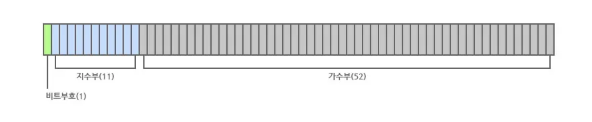
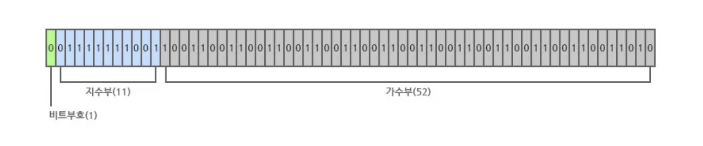
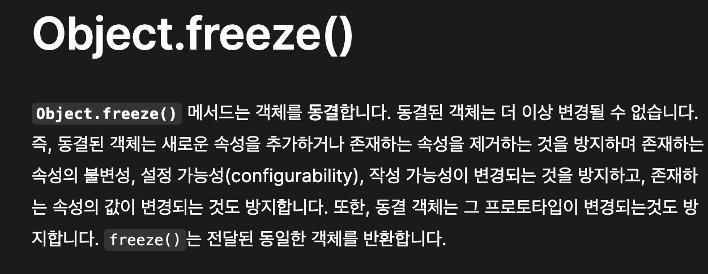

# 6장 - 9장:: JS Is Weird!

### 목차

```jsx
const getPresentationInfo = (index) => {
  let result;

  switch (index) {
    case '6-1':
      result = 'number';
      break;
    case '6-2':
      result = 'object';
      break;
    default:
      result = 'JS Is Weird';
  }

  return result;
};
// 주제에서 8장의 제어문은 생략할거라 간단하게 목차로 활용해봤습니다 😊
```

# JS Is Weird

자바스크립트의 `연산`과 `타입 변환` 에 대한 문제들을 통해 `이상한` 문법들을 알아보자

[JS is weird](https://jsisweird.com/)

> 💡JS Is Weird 에서 보면 좋을 문제들을 뽑아봤습니다 !  
주의* 아래의 토글은 문제를 풀어보고 열어볼 것

<details>
  <summary>2. [**undefined**,**undefined**,**undefined**].length</summary>
  <div markdown="1">
    `3`
    
    빈 공간에는 undefined 가 들어간다.  
    마지막의 `,`는 trailing comma 이다.  
    따라서 undefined 로 채워진 값이 3개이기 때문에 3이라는 결과가 반환된다.
    
    참고로 trailing comma 란, 한국어로 후행 콤마로 배열이나 객체의 항목 마지막에 단순히 붙이는 것이다.    
    후행 콤마가 있으면 나중에 신규 값 추가시, 기존 line의 수정없이 코드를 작성할 수 있다는 편리함이 있다.
    
    cf) https://developer.mozilla.org/ko/docs/Web/JavaScript/Reference/Trailing_commas
  </div>
</details>

<details>
  <summary>3. [1, 2, 3] + [4, 5, 6]</summary>
  <div markdown="1">
    `"1,2,34,5,6"`
  
    배열에 + 연산시, string 타입으로 변환된다.    
    Object 나 Array 처럼 프로토타입에 `toString()` method 가 있으면 string으로 형변환된다.    
    배열을 문자열로 변환하면 각 값에 ,(쉼표)로 연결된 문자열이 반환된다. (공백x)
    
    [1, 2, 3] => '1,2,3'   
    [4, 5, 6] => '4,5,6'    
    즉, '1,2,3' + '4,5,6' 이므로    
    중간 값들이 그대로 붙여진 "1,2,34,5,6" 이 반환되는 것이다.
  </div>
</details>

<details>
  <summary>4. 0.2 + 0.1 === 0.3</summary>
  <div markdown="1">
    `false`
    
    0.2 + 0.1는 0.30000000000000004 이다.    
    그 이유는 자바스크립트의 number가 64비트 부동소수점으로 표현되기 때문에 정확한 값으로 산출되지 않는다.
    
    64비트 부동소수점이란 뭘까?   
    [Number](https://www.notion.so/Number-c9bc1487904d4c258f3f07168bfd87f0?pvs=21) 페이지로 가봅시다!
  </div>
</details>

<details>
  <summary>11. "" - - ""</summary>
  <div markdown="1">
    `0`
    
    `+` 연산자와 다르게, `-` 연산자는 Number 타입으로 우선 형변환된다.    
    “” ⇒ 0    
    0 - (-0)    
    0-0    
    = 0    
  </div>
</details>

<details>
  <summary>24. "" && -0</summary>
  <div markdown="1">
    `""`

    && (논리적 and 연산자)는 왼쪽에서 오른쪽으로 평가한다.     
    `“”` ⇒ false 니까 오른쪽으로 가지 못하고 falsy한 해당 값을 반환한다.  
    
    `3 && 5` ⇒ 5를 반환한다.
  </div>
</details>

<details>
  <summary>+. NaN === 0/0</summary>
  <div markdown="1">
    `false`

    `0/0` 는 NaN이다.    
    그러면 NaN === NaN 으로 보일 수 있지만 false 이다.      
    대신 Object.is 를 통해 비교했을 때에는 true 이다.      
    Object.is(NaN, 0/0)
  </div>
</details>

# Number

> 자바스크립트의 숫자는 `64비트 부동소수점` 형식으로 저장된다.

Java의 `int` , `char` 숫자에 대한 여러 데이터 타입이 있는 언어와 다르게 Javascript는 숫자 타입이 하나이다.

사람은 숫자를 10진법, 컴퓨터는 2진법으로 표현한다.  
- (모든 데이터를 0, 1로 이루어진 이진수로 처리)  
- 하나의 비트(bit) 는 0 또는 1의 값을 지닌다

### 64비트?

자바스크립트 Number 타입은 64비트의 고정된 크기 공간을 가지고 있다.

### 부동소수점?

뜰 부, 움직일 동  
Floating Point  
매우 큰/작은 숫자를 효율적으로 표현하기 위한 방법  
자바, 파이썬의 `float`, 자바스크립트의 `number`  
“소수점이 위치를 떠다닌다” ⇒ 숫자의 크기에 따라 소수점의 위치가 변동한다

### 64비트의 부동소수점 숫자?

부동소수점 숫자를 64비트로 표현하는 방식을 알아보자.

- Sign Bit (부호 비트)
  - 숫자가 양수인지 음수인지 표현
  - 0: 양수, 1: 음수
- Exponent (지수)
  - 소수점이 어디 위치에 있는지 결정
  - 소수점이 움직일 칸의 개수 나타냄
- Mantissa (가수)
  - 숫자의 유효숫자



(아래는 0.1을 부동소수점으로 나타낸 그림)


### `9.625`를 예시로 부동소수점에 대해 알아보자

9.625 를 2진수로 표현 ⇒ 1001.101
- 9 ⇒ 1001
- 0.625 ⇒ 101

부동소수점은 모든 숫자를 1.xxx 형식으로 변환  
1001.101 ⇒ 1.001101 로 변환시키려면 소수점이 왼쪽으로 3칸 이동: `지수`  
⇒ 소수점이 움직이기 때문에 `부동`  
나머지 52비트는 소수점이 움직인 결과 (1.001101)를 기준으로, 소수점 뒷부분의 값들을 채워넣는 것: `가수`  

유효 숫자가 52비트를 넘어가게 되면 반올림을 해서 저장한다  
= 정확한 숫자가 아닌 근사치를 얻게 된다

[자바스크립트의 실수 계산 오류](https://medium.com/@syalot005006/자바스크립트의-실수-계산-오류-a72ec3326b50)

[부동소수점 (+ 실수계산 오차가 생기는 이유)](https://www.youtube.com/watch?v=ZQDsWySjY6g)

# Object

## `object.is()` method 란?

```jsx
Object.is(value1, value2)
// value1과 value2의 값이 같은지 판단
```

https://developer.mozilla.org/ko/docs/Web/JavaScript/Reference/Global_Objects/Object/is

### 특이점

`===` 와의 차이

- NaN
  - NaN === 0/0 : false
  - Object.is(NaN, 0/0) : true
- 부호 있는 0
  - 0 === -0 :  true
  - Object.is(0, -0) : false

### React에서 사용

- useState 
  - Object.is(currentValue, newValue)
  - setState 호출 시, 위의 비교를 통해 동일하다면 업데이트 x  

- React.memo 
  - Object.is(previousProps, nextProps)
  - Object.is 를 통해 이전 props 와 새 props를 비교  

- 의존성 배열 
  - useEffect, useCallback, useMemo 등 의존성 배열을 파라미터로 받는 hook 에서 모두 비교시 사용

### React에서 사용하는 코드를 직접 확인해보자

```typescript
function areHookInputsEqual(
        nextDeps: Array<mixed>,
        prevDeps: Array<mixed> | null,
): boolean {

// ...

  for (let i = 0; i < prevDeps.length && i < nextDeps.length; i++) {
    if (is(nextDeps[i], prevDeps[i])) {
      continue;
    }
    return false;
  }
  return true;
}
```

```typescript
// react/packages/shared/objectIs.js

/**
 * inlined Object.is polyfill to avoid requiring consumers ship their own
 * https://developer.mozilla.org/en-US/docs/Web/JavaScript/Reference/Global_Objects/Object/is
 */
function is(x: any, y: any) {
  return (
          (x === y && (x !== 0 || 1 / x === 1 / y)) || (x !== x && y !== y) // eslint-disable-line no-self-compare
  );
}

const objectIs: (x: any, y: any) => boolean =
        typeof Object.is === 'function' ? Object.is : is;

export default objectIs;
```

### Object.freeze()



+ deepFreeze
https://developer.mozilla.org/ko/docs/Web/JavaScript/Reference/Global_Objects/Object/freeze