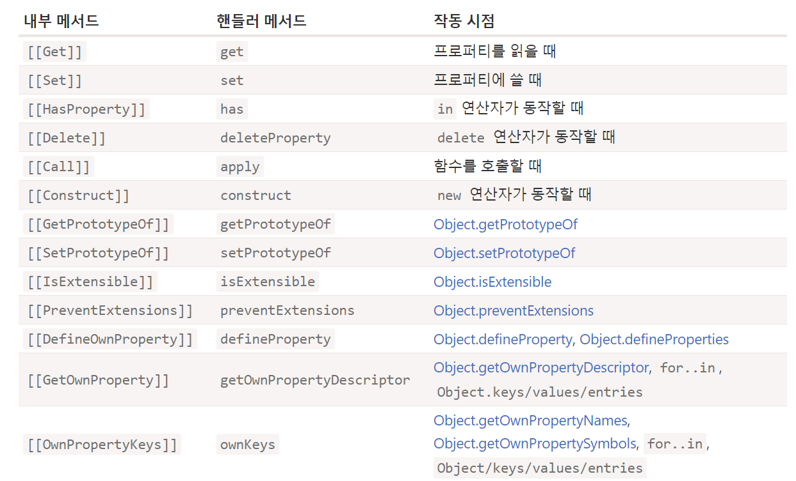

# 13장 - 15장 :: 객체의 확장 다루기

- Object.preventExtensions ↔ Object.isExtensible
- Object.seal ↔ Object.isSealed
- Object.freeze ↔ Object.isFrozen
- new Proxy

## when?

선언한 객체의 변경을 방지하고 싶을 때.  
각 method 들은 금지하는 강도가 달라서 의도에 맞게 사용한다  
공통 소스 (다른 개발자가 접근하여 수정할 수 있을 경우 or 오픈 소스 개발시..)에 객체 선언시 유용할 것 같다

## Object.preventExtensions

> 객체의 확장 금지 (추가 할당 불가)

↔ Object.isExtensible

추가 X  
삭제 O  
갱신 O (기존 속성값)

## Object.seal

> 객체 밀봉 (읽기와 쓰기만 가능)

↔ Object.isSealed

추가 X  
삭제 X  
갱신 O (기존 속성값)

## Object.freeze

> 객체 동결하기 (읽기만 가능)

↔ Object.isFrozen

추가 X  
삭제 X  
갱신 X (기존 속성값) — 중첩 객체는 O

## 사용하기

```typescript
// React

// an immutable object with a single mutable value
export function createRef(): RefObject {
  const refObject = {
    current: null,
  };
  if (__DEV__) {
    Object.seal(refObject);
  }
  return refObject;
}

export const zeroPoint: Point = Object.freeze({x: 0, y: 0});
```

## 이중(중첩) 객체는 어떻게?

모두 중첩 객체에 영향을 주지 못한다!  
`얕은 변경`에 의해 최상위 프로퍼티만 변경이 방지된다  
⇒ 재귀적으로 각 Deps 의 모든 프로퍼티에 일일이 method를 호출해서 적용해야 한다

## 에러가 발생하는가?

엄격 모드에서는 TypeError 발생

```jsx
"use strict";
const obj = Object.freeze({ a: 1 });
obj.a = 2;  // TypeError: Cannot assign to read-only property 'a'
```

## Set, Map 객체도 적용 가능한가?

불가능하다  
다만 `Proxy` method 를 통해 처리 가능!

## Proxy 란?

proxy 의 사전적인 뜻은 ‘대리인’  
Javascript 에서는 한 객체에 대한 기본 작업을 가로채고, 재정의하는 것  
`new` 생성자를 통해 등록 가능

- parameter
  - target
      - proxy할 원본 객체 (함수를 포함한 Set, Map 등 모든 객체 가능)
  - handler
      - 가로챌(trap) 작업을 정의하는 객체
      - 비어있다면, 일반 객체와 동일하게 동작한다

```jsx
const target = {}; // new Map()
const proxy = new Proxy(target, {}); // 빈 핸들러

proxy.test = 5; //  프록시에 값을 입력.
alert(target.test); // 5, target에 새로운 프로퍼티가 생성됨.
```

### `handler` 에 대해 더 알아보기

```jsx
const handler = {
    get(target,prop) { ... },    
    set(target,prop,value) { ... },    
    has(target,prop) { ... },    
    ...
}
```

- trap
    - 동작을 가로채는 함수. (기본적으로 정의된 메서드)
    - get(읽을 때), set(쓸 때), has(`in` 연산자 사용시) …
- parameter
    - method 마다 다름
    - target (원본 객체)
    - prop: 접근하려는 속성명(get), 설정하려는 속성명(set)
    - receiver: 프록시 객체 this
    - value: 할당하려는 값



https://meetup.nhncloud.com/posts/302

### `Proxy` 를 이용해 `Set` 객체의 확장 막기

```jsx
const mySet = new Set([1, 2, 3]);

const proxySet = new Proxy(mySet, {
  get(target, prop) {
    if (prop === 'add') {
      throw new Error('add method is disabled');
    }
    return target[prop];
  }
});

proxySet.add(4);  // Error: add method is disabled

```