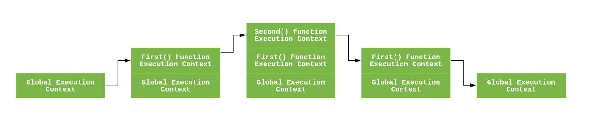

# 23장 - 24장:: 실행 컨텍스트로 알아보는 호이스팅

> 📅 스터디 날짜: 2024년 11월 11일

# 호이스팅이란?


> hoist
: (흔히 밧줄이나 장비를 이용하여) 들어[끌어]올리다

인터프리터가 코드를 실행하기 전에 함수, 변수, 클래스 또는 임포트(import)의 선언문을 해당 범위의 **맨 위**로 끌어올리는 것처럼 보이는 현상

선언한 위치와 별개로, 마치 최상단에 선언된 것처럼 동작

```jsx
console.log(a);
// undefined (오류 없이 동작) -- 할당 이전이기에 'undefined'

var a = 10;
```

# 실행 컨텍스트



전역 실행 컨텍스트가 가장 먼저 스택에 추가되고  
이후에 함수 호출할 때마다 새로운 실행 컨텍스트가 만들어진다. (스택에 추가)  
그리고 함수 실행이 완료되면 스택에서 제거된다.  
전역 실행 컨텍스트는 어플리케이션 종료될 때까지 유지된다. (웹페이지 나가거나 브라우저 종료시)  


```text
💡 소스코드가 로드되면 자바스크립트 엔진은 전역 코드 평가

<코드 평가 과정>

1. 전역 실행 컨텍스트 생성
2. 전역 렉시컬 환경 생성
    1. **전역 환경 레코드 생성**
        1. **객체 환경 레코드 생성**
        2. **선언적 환경 레코드 생성**
    2. this 바인딩
    3. 외부 렉시컬 환경에 대한 참조 결정
```


# 렉시컬 환경이란?

식별자와 식별자에 바인딩된 값, 그리고 상위 스코프에 대한 참조를 기록하는 자료구조로 실행 컨텍스트를 구성하는 컴포넌트  
—> 스코프와 식별자를 관리  
(식별자와 변수의 맵핑이 이루어지는 공간)  
Environment Record 와 Outer Environment Reference 로 구성  

## 환경 레코드란?

> Environment Record

실행 컨텍스트 내에서 변수와 함수의 선언을 저장하고 관리하는 구조체  
자바스크립트 엔진은 코드 평가시 **Environment Record 에 식별자의 정보를 수집**한다.  
이미 실행하기도 전에 해당 컨텍스트 내부의 변수명을 알고 있다

## 호이스팅의 의미

호이스팅은 물리적으로 끌어 올린 것이 아닌,  
**실행 컨텍스트 관점에서는 이미 식별자들의 정보를 알고** 있기 때문에, 선언 이전에 사용 가능한 것이며  
이는 끌어 올리는 것과 같다라는 개념으로 생겨났다.

# TDZ

> Temporal Dead Zone   
> 일시적 사각지대

호이스팅은 되었지만, 아직 선언되지 않은 변수가 있는 곳  
변수가 선언되는 시점에는 TDZ 탈출

`var`(+함수 선언문) vs `let/const`

```jsx
console.log(a); // undefined
console.log(b); // Uncaught ReferenceError: b is not defined

const c = 3;
console.log(c); // 3

var a = 1;
console.log(a); // 1

let b = 2;
```

### 전역 환경 레코드는 “**객체 환경 레코드”** 와 “**선언적 환경 레코드”** 로 구성

- 객체 환경 레코드 (Object Environment Record)  
  `var` 로 선언된 변수 (+ 할당된 함수 표현식), 함수 선언문
    - bindingObject 객체에 연결된다
        - 객체 환경 레코드에 등록한 식별자는 bindingObject의 식별자가 되며,
        - 전역 환경 레코드에서의 Object Environment Record의 `bindingObject`는 전역 객체 (window)
            - **⇒ 전역 객체의 프로퍼티** (ex - window.y) 처럼 바로 사용할 수 있다
            - (window 는 생략 가능)
- 선언적 환경 레코드 (Declarative Environment Record)  
  `let`, `const` 로 선언된 변수 (+할당된 함수 표현식)  
    - **전역 객체의 프로퍼티**가 되지 않고, 선언한 **블록**내에 존재 (window.y 처럼 참조 불가능)

### 변수 생성 과정의 차이

- var
    - 선언될 때, `undefined` 로 초기화
    - 이전에 참조시, undefined 값이 반환
- let/const
    - “선언 단계”와 “초기화 단계”가 분리
        - 코드 평가 단계에서는 ‘선언 단계’
        - 코드 실행 단계에서는 ‘초기화 단계’
        - → 값을 할당하기 전까지는 값이 없는 상태
    - 초기화 단계인 **런타임**에 **변수 선언문에 도달**하기 전까지는 일시적 사각지대(TDZ)에 빠지게 된다!
    - **호이스팅은 발생하지만, TDZ로 인해 “참조"할 수 없는 것이다**