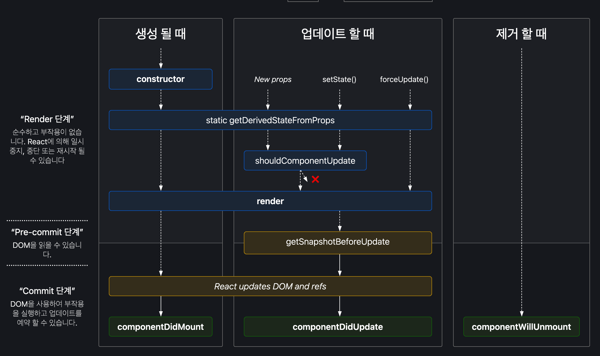

# 25장:: React에서의 Class component 사용

> 📅 스터디 날짜: 2024년 11월 19일

# 상속

### React.Component

React에서 Class형 컴포넌트 정의시, `React.Component` 상속 필요

```jsx
class Welcome extends React.Component {
  render() {
    return <h1>Hello, {this.props.name}</h1>;
  }
}
```

- 사용 가능한 내장 기능
    - this.props
    - this.state
        - state는 무조건 객체여야 한다.

        ```jsx
        this.state = {
          age: 42,
        };
        // this.setState(...)
        ```

    - LifeCycle
        - 밑에서 확인 !

### React.PureComponent

`Component` 의 서브클래스이지만, **동일한 props, state**에 대해선 **재렌더링 X**

⇒ Class component 최적화에 유용

```jsx
import { PureComponent } from 'react';

class Greeting extends PureComponent {
  render() {
    return <h1>Hello, {this.props.name}!</h1>;
  }
}
```

- 특징
    - `React.memo` 와 동일한 기능
        - 다만, `React.memo` 는 old state 와 new state 비교 x
    - 얕은 비교
        - 객체에서 내부 값 변경시, 참조가 동일하면 감지 X

# 라이프사이클



cf. https://projects.wojtekmaj.pl/react-lifecycle-methods-diagram/

## Mount

### constructor(props)

컴포넌트 실행시, 가장 먼저 **최초에 1번** 실행

- React에서의 목적
    - state 선언
    - Class method를 Class instance에 Binding

    ```jsx
    class Counter extends Component {
      constructor(props) {
        super(props);
        this.state = { counter: 0 };
        this.handleClick = this.handleClick.bind(this);
      }
    
      handleClick() {
        // ...
      }
    ```


### componentWillMount()

*// Deprecated — 안전하지 않은 생명주기*  
`constructor` 직후 화면 렌더링 되기 전에 진행.

### render()

Class component에서 필수로 있어야 하는 method  
화면에 표시할 내용을 지정.  
JSX 반환

[`shouldComponentUpdate`](https://ko.react.dev/reference/react/Component#shouldcomponentupdate) 에서 false 반환 시, render 진행 X

### componentDidMount()

구성 요소가 **화면에 추가**될 때 실행 (최초 1번)  
= `useEffect`   
- 용도
    - Data fetch
    - DOM 요소 조작
    - setTimeOut 과 같은 window event 진행
- 주의) 매개변수 X, 반환 값 X

## Update

### componentWillReceiveProps(nextProps)

*// Deprecated — 안전하지 않은 생명주기*  
**새로운 props** 수신할 때 호출  
props 변경에 대한 응답으로 부수효과 실행 (data fetch, 애니메이션 실행, store 초기화..)

### shouldComponentUpdate(nextProps, nextState, nextContext)

재렌더링 여부 판단  
`false` 반환시 → 재렌더링 건너뛴다.  
초기 렌더링에는 호출X  
라이프사이클 지정안하면, default 값은 `true` 이다.

- 용도) 성능 최적화
- 주의
    - shouldComponentUpdate 보다 [`PureComponent`](https://ko.react.dev/reference/react/PureComponent) 사용하는 것이 유용할수도.
    - 객체 비교시 → JSON.stringify 주로 사용하지만, 객체 깊으면 시간 오래 걸려 성능에 영향

```jsx
shouldComponentUpdate(nextProps, nextState) {
    if (
      nextProps.position.x === this.props.position.x &&
      nextProps.position.y === this.props.position.y &&
      nextProps.size.width === this.props.size.width &&
      nextProps.size.height === this.props.size.height &&
      nextState.isHovered === this.state.isHovered
    ) {
      // 변경된 사항이 없으므로 다시 렌더링할 필요가 없습니다.
      return false;
    }
    return true;
  }
```

### componentWillUpdate(nextProps, nextState)

### [render](https://www.notion.so/1431abb4cd3480919901d84fbb851aeb?pvs=21)

### componentDidUpdate(prevProps, prevState, snapshot)

```jsx
componentDidUpdate(prevProps, prevState) {
    if (
      this.props.roomId !== prevProps.roomId ||
      this.state.serverUrl !== prevState.serverUrl
    ) {
      this.destroyConnection();
      this.setupConnection();
    }
  }
```

props 또는 state가 변경되어 렌더링된 **직후**  
초기 렌더링에는 호출 X  
= `useEffect` (+ 의존성 배열)  
- 용도
    - 업데이트 후 DOM 조작
    - props 비교하여 data fetch 혹은 비즈니스 로직 수정
- 주의
    - 내부에서 if문 통해 정확한 props 값 비교 필요
        - 모든 props 바뀔 때마다 함수가 진행되기 때문
    - `setState` 사용 X
        - 작동되는 순간 다시 해당 라이프사이클 진행 → 무한 루프


## Unmount

### componentWillUnmount()

컴포넌트가 화면에서 **제거되기 직전**  
`componentDidMount` 의 내부 로직을 **Mirroring** 해야 한다  
= clean-up function  
- 용도
    - 데이터 불러오기 취소
    - 구독 제거 (ex. setInterval) — `componentDidMount`

# static 사용한 내장 기능

`static` 키워드를 통해, 해당 클래스 컴포넌트 자체와 관련된 설정 값을 선언적으로 사용  
⇒ 클래스 컴포넌트의 설정과 구조화를 단순화 + 명확한 코드 작성

### defaultProps

Class 의 기본 props 설정  
`undefined`와 누락된 props에 사용  
`null` props에는 X

```jsx
class Button extends Component {
  static defaultProps = {
    color: 'blue'
  };

  render() {
    return <button className={this.props.color}>click me</button>;
  }
}
```

= 함수형 컴포넌트의 `default values`  
props 에 기본 값 지정시, `=` 를 통해 세팅

```jsx
function Avatar({ person, size = 100 }) {
  // ...
}
```

### PropTypes

props 의 타입 검증을 위해 사용  
런타임에서만 확인 가능 → Javascript를 일종의 타입스크립트처럼 사용 가능  
잘못된 props 타입 전달시 경고

```jsx
// import React, PropTypes from 'react';
import PropTypes from 'prop-types';

class Greeting extends React.Component {
  static propTypes = {
    name: PropTypes.string,
    title: PropTypes.string.isRequired,
  };

  render() {
    return (
      <h1>Hello, {this.props.name}</h1>
    );
  }
}
```

- etc
    - React 15.5 를 기준으로, React 코어에서 `PropTypes` 분리
        - 기존: React에서 import
        - 현재: `prop-types` 패키지 설치 필요
    - React 16 이후로는 *Deprecated …*